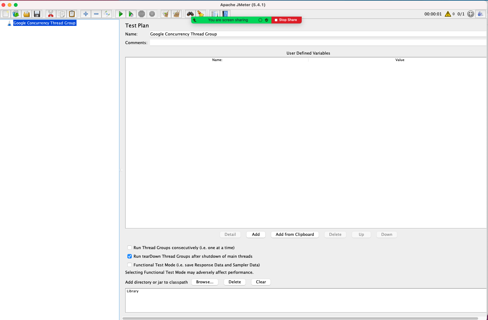
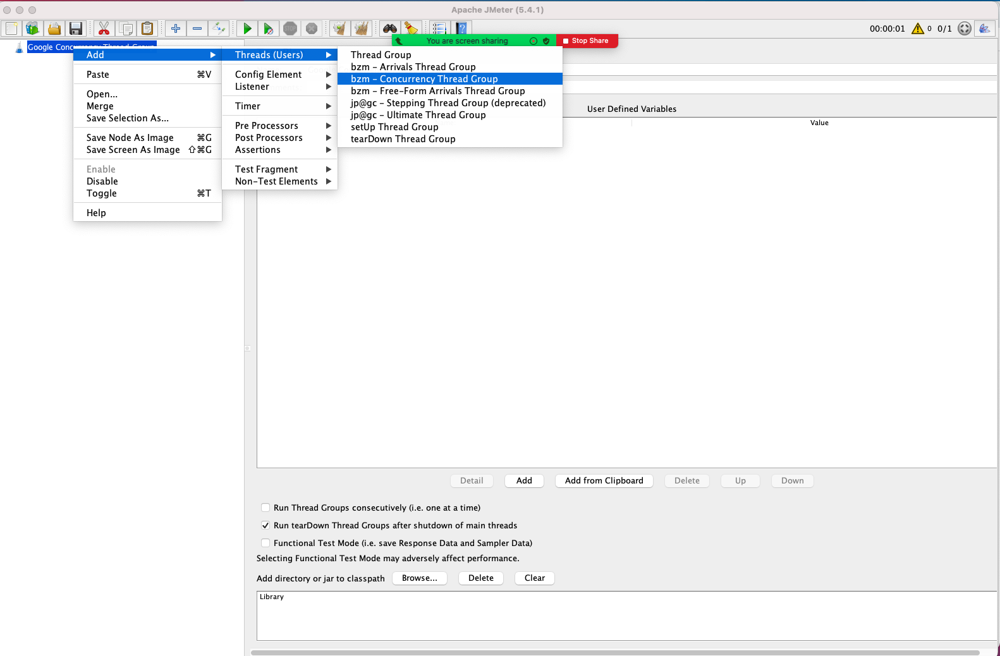
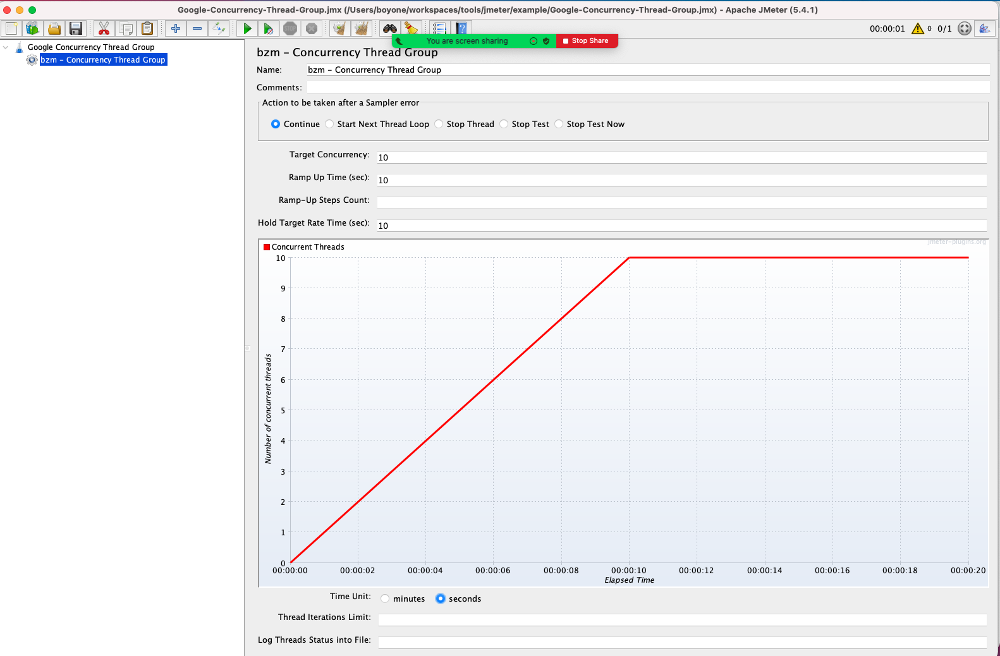
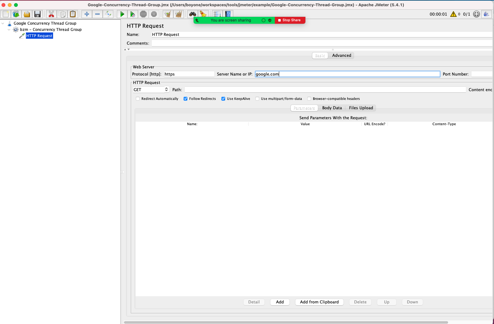

# Concurrency Thread Group

- Prerequisite: Install [Custom Thread Group](./jmeter-plugins.md)

1. Create Test Plan: Name `Google Concurrency Thread Group`
   
2. Add Thread Group: Select `bzm - Concurrency Thread Group`
   
3. Set `Concurrency Thread Group Properties`

   - Time Unit: select `seconds`
   - Target Concurrency: `10`
   - Ramp Up Time(sec): `10`
   - Hold Target Rate Time(sec): `10`

   

4. Add Sample: Select `HTTP Request`
   - Protocol[http]: `https`
   - Set Server Name or IP: `google.com`
     
