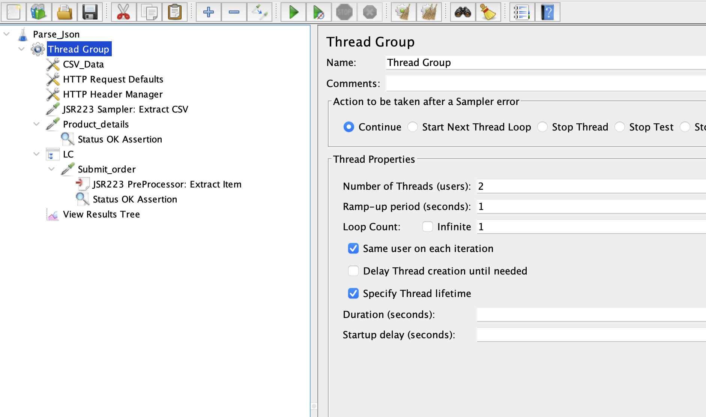
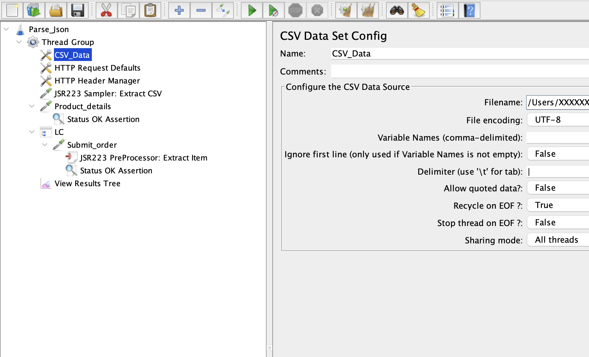
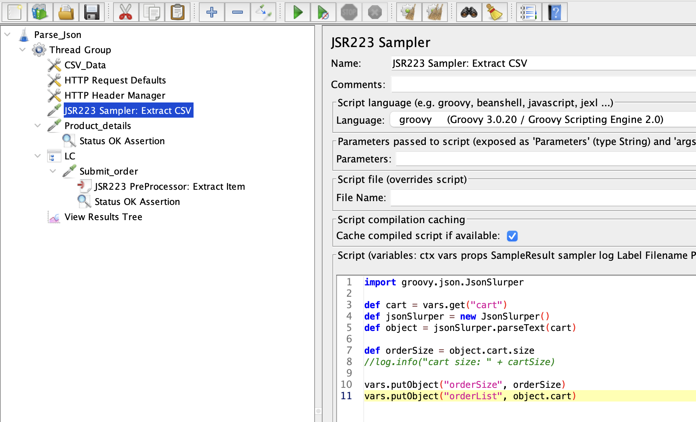
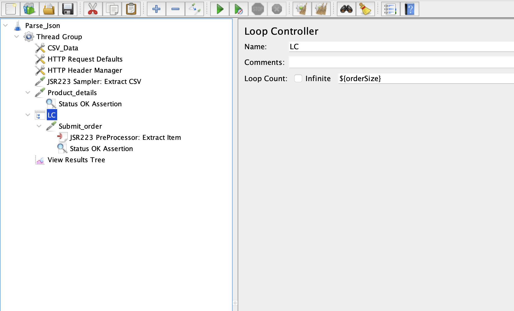
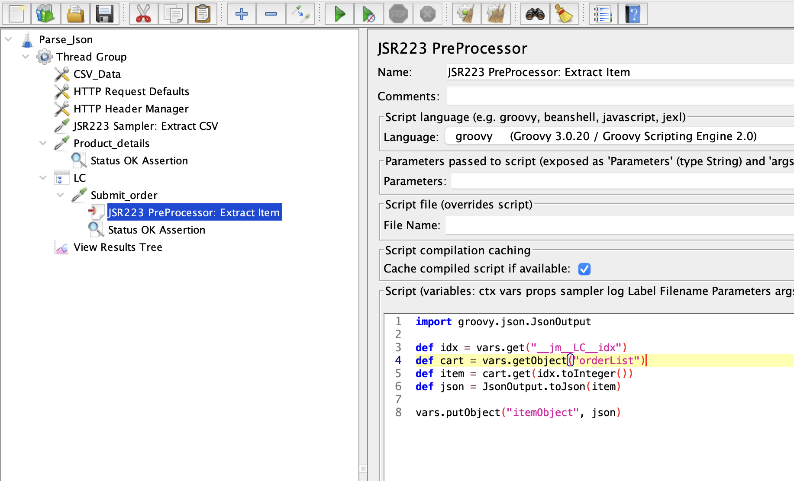
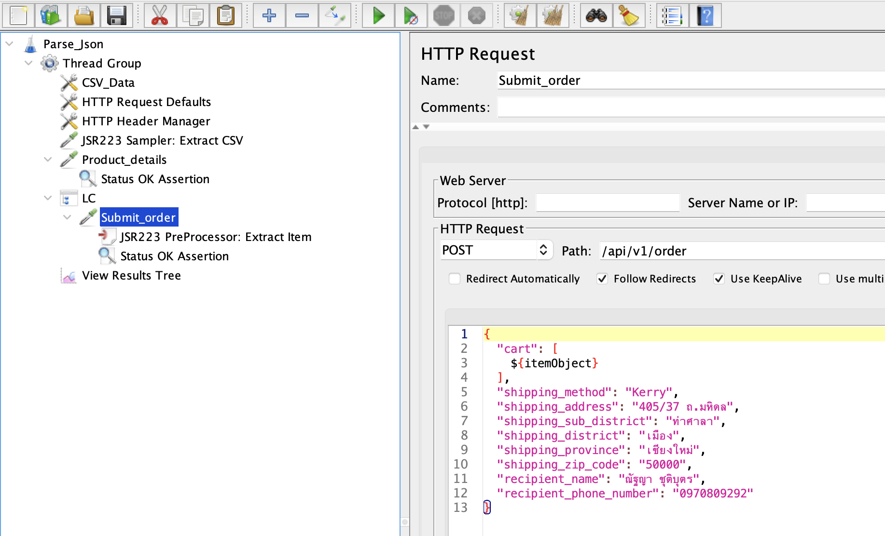
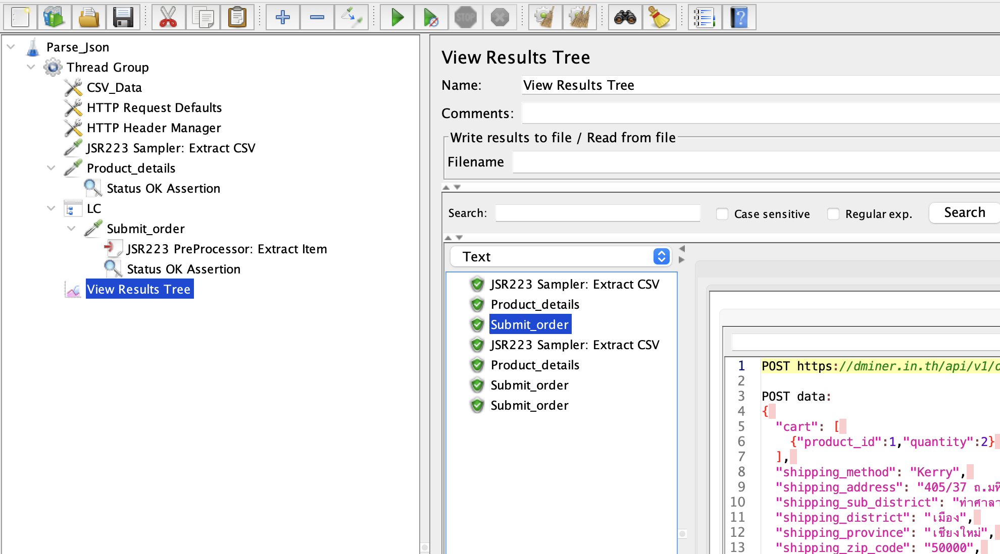
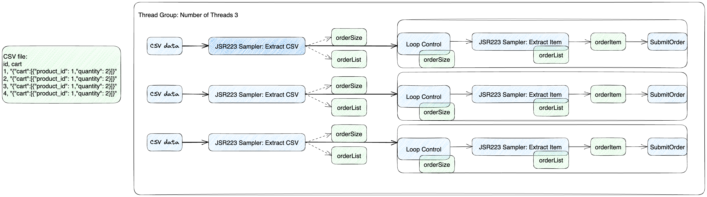

# CSV, JSR 223, and Loop Control

1. CSV file

   ```csv
   id,cart
   1|{"cart":[{"product_id": 1,"quantity": 2}]}
   2|{"cart":[{"product_id": 2,"quantity": 1},{"product_id": 1,"quantity": 2}]}
   ```

   > แบ่งข้อมูลด้วย `|` เนื่องจากติดข้อจำกัดในการที่จะ `Parse` ข้อมูลไปเป็นแบบ `JSON`

2. Tread Group

   

   > ตั้งค่าจำนวนการทดสอบจาก `Number of Threads` และ `Loop Count` ให้เท่ากับจำนวนข้อมูลจาก `CSV file`

3. CSV Config

   

   > ตั้งค่า `Delimeter` เป็น `|`

4. Extract CSV

   

   > Extract ค่า `cart` จาก `csv` โดยหาขนาดของ order และ orderList

5. Loop Control

   

   > ตั้งค่า `Loop Count` เป็น `${orderSize}`

6. Extract Order Item

   

   > ตั้งค่า `itemObject` จากตำแหน่ง `idx` ของ `orderList`

7. Summit Order

   

   > แทนที่ `"cart" : [ .... ]` ด้วย `${itemObject}`

8. Results Tree

   

   > เกิดการทำ `Submit Order` จำนวน 3 ครั้ง

9. Overview

   
