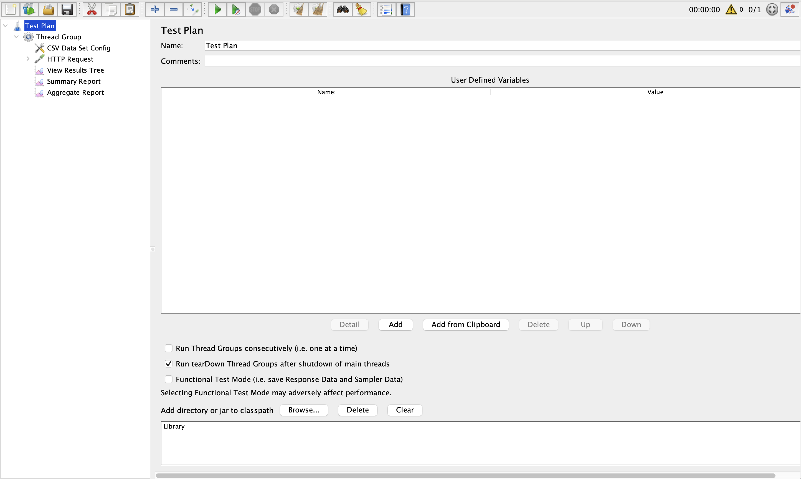
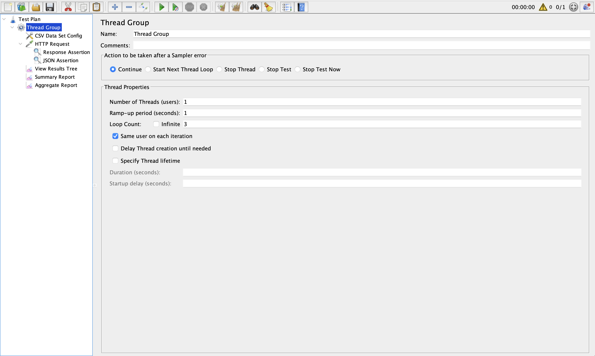
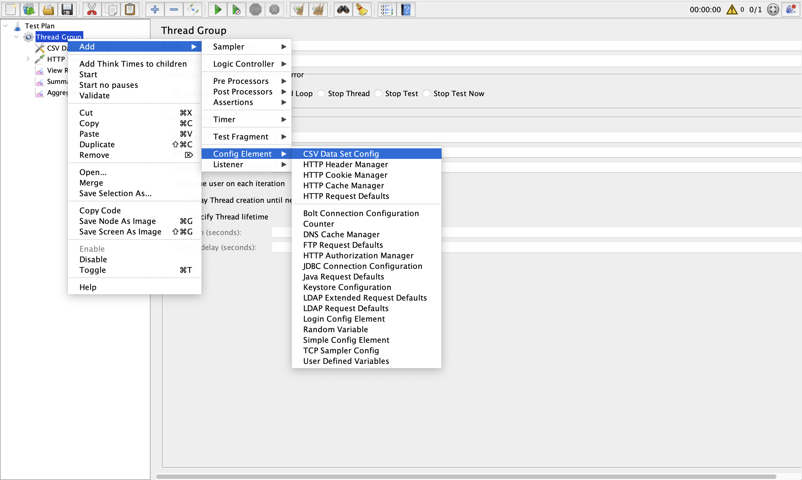
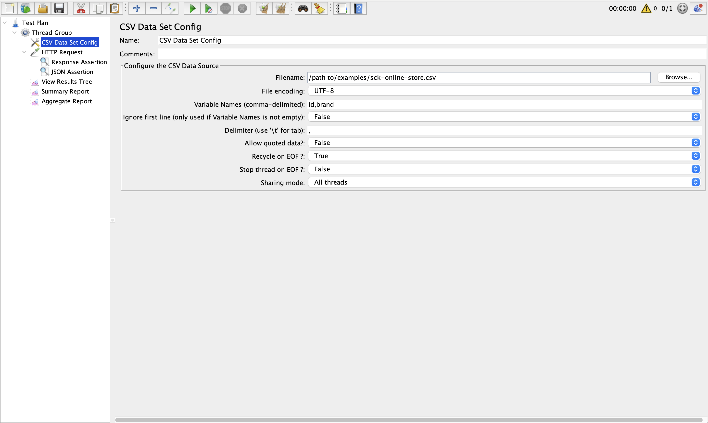
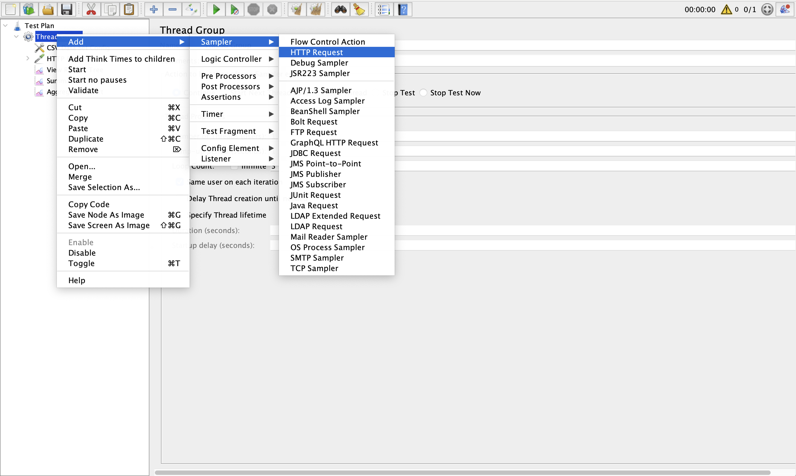
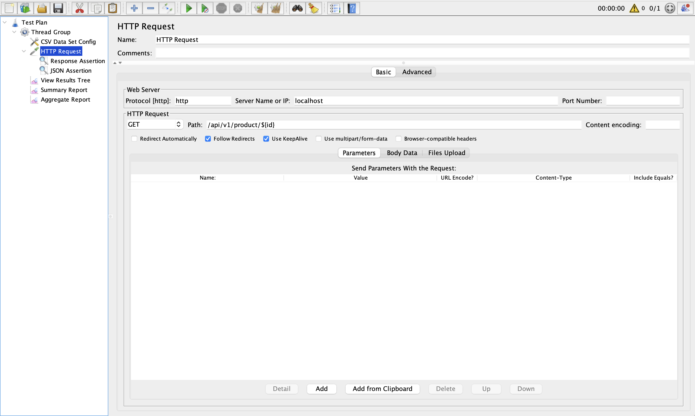
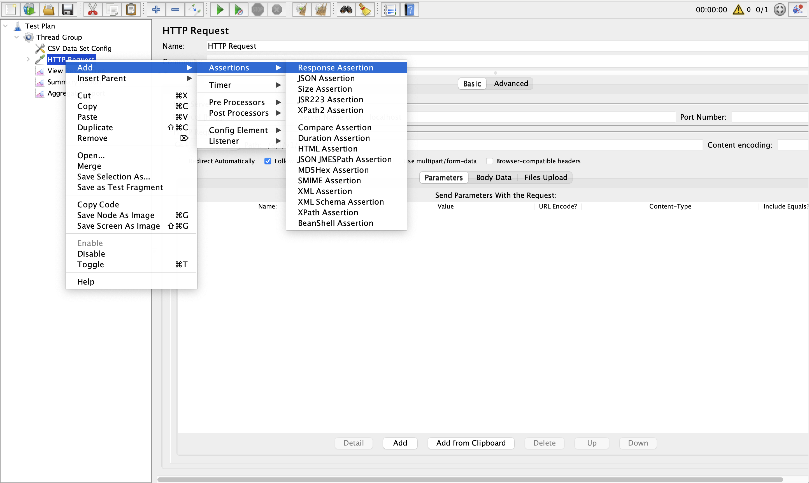
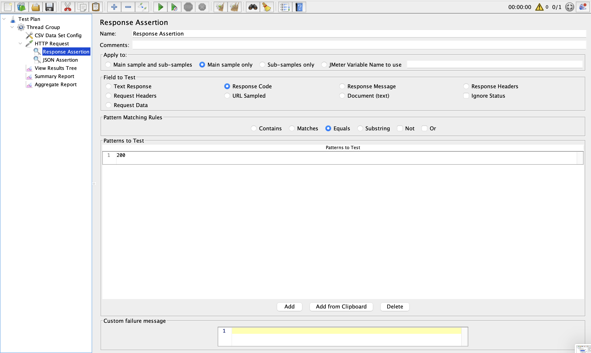
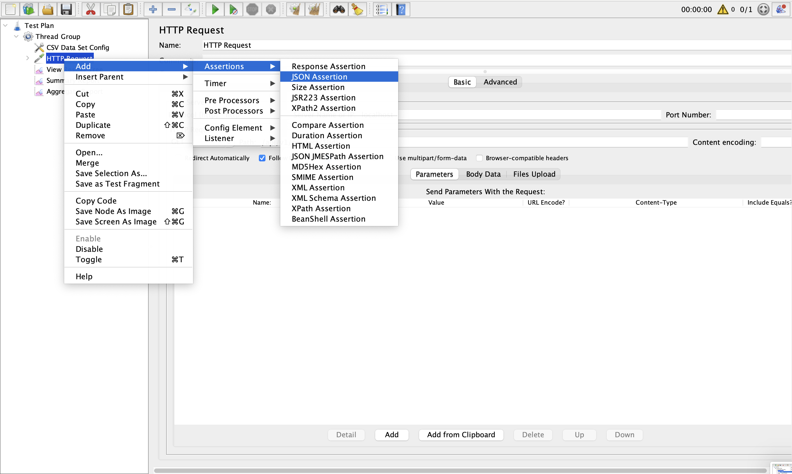
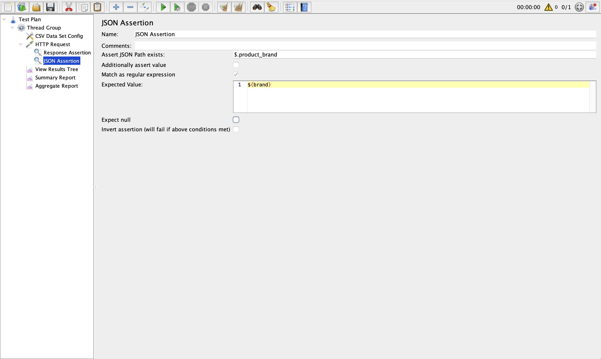

# Data Driven with CSV

1. [Start Sck Online Store](#start-sck-online-store)
2. [Create Test Plan](#create-test-plan)

---

## Start `sck-online-store`

1. Clone `sck-online-store` from github to `workspace`

   ```sh
   git clone https://github.com/SCK-SEAL-TEAM-One/sck-online-store.git
   ```

2. Change directory to `sck-online-store`

   ```sh
   cd sck-online-store
   ```

3. Start sck-online-store with docker compose

   ```sh
   docker compose up -d thirdparty point-service db store-service store-web nginx
   ```

---

## Create Test Plan

1. Create Test Plan call `Test_Plan`
   
2. Create Test Group with `Thread Group`
   
3. Set `CSV Data Set Config`
   
   
4. Set `Http Request`
   
   
5. Add `Response Assertion`
    
    
6. Add `JSON Assertion`
    
    

---

## References

1. [jmeter csv dataset config](https://www.blazemeter.com/blog/jmeter-csv-dataset-config)