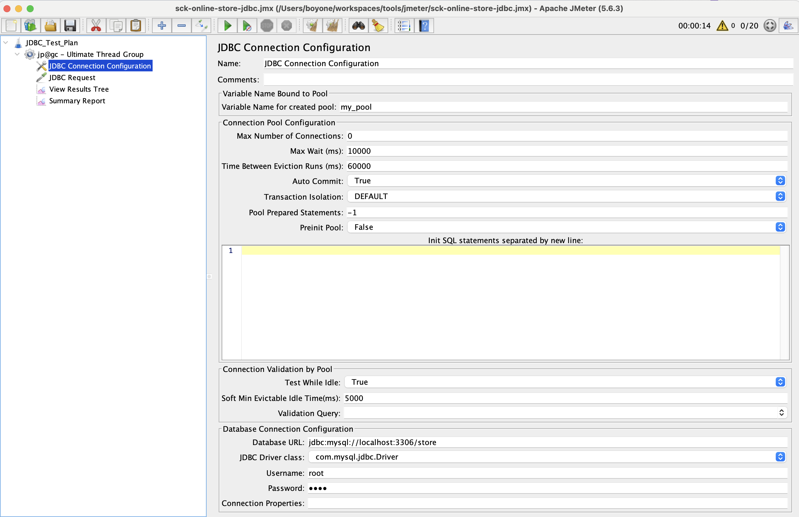
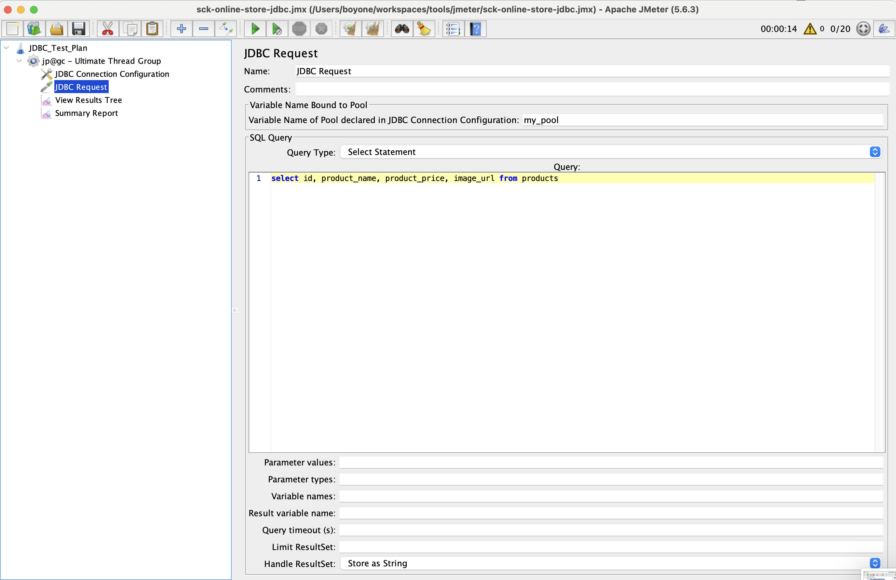

# Jmeter JDBC Test Plan

---

## Start database

1. Clone `sck-online-store` from github to `workspace`

   ```sh
   git clone https://github.com/SCK-SEAL-TEAM-One/sck-online-store.git
   ```

2. Change directory to `sck-online-store`

   ```sh
   cd sck-online-store
   ```

3. Start database with docker compose

   ```sh
   docker compose up -d db
   ```

---

## Create Test Plan

1. Create Test Plan call `JDBC_Test_Plan`
   
2. Create Test Group with `Ultimate Thread Group`
   
   
3. Set `JDBC Connection Configuration`
   
   
4. Set `JDBC Request`
   
   

---

## JDBC Driver

1. [mysql](https://downloads.mysql.com/archives/c-j/)
2. [oracle](https://www.oracle.com/th/database/technologies/appdev/jdbc-downloads.html)
3. [postgresql](https://jdbc.postgresql.org/download/)
4. [mariadb](https://mariadb.com/downloads/connectors/connectors-data-access/java8-connector)

---

## References

1. [build-db-test-plan](https://jmeter.apache.org/usermanual/build-db-test-plan.html)
2. [jmeter-parameterization](https://www.blazemeter.com/blog/jmeter-parameterization)
