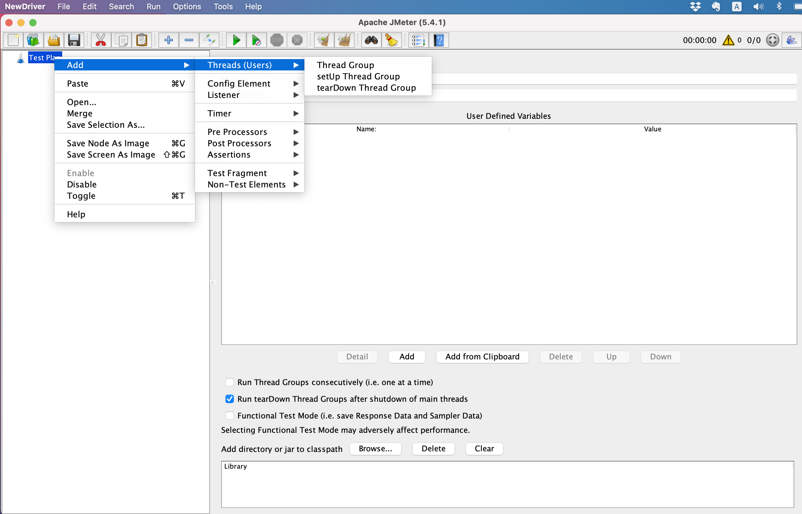
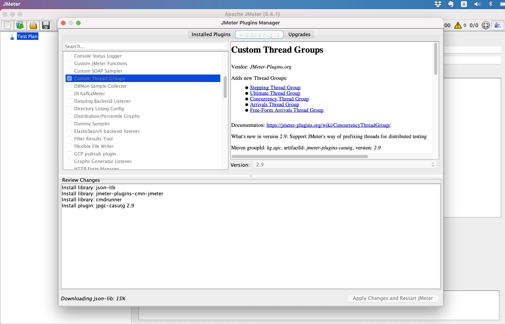
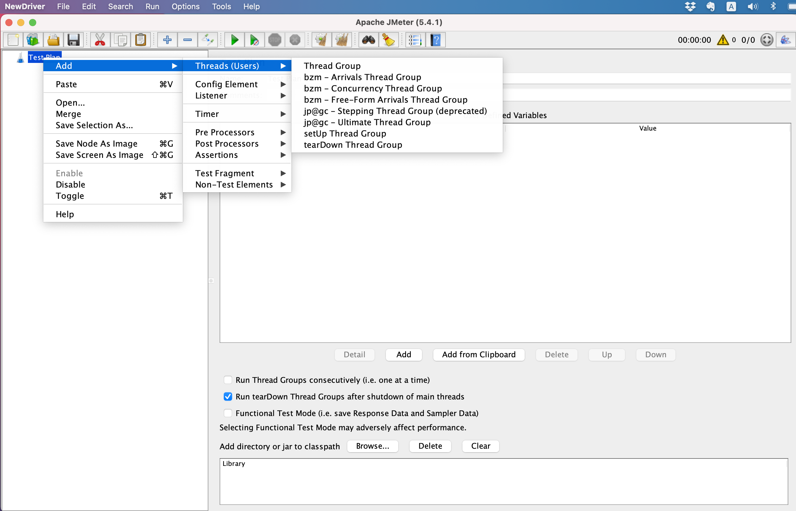
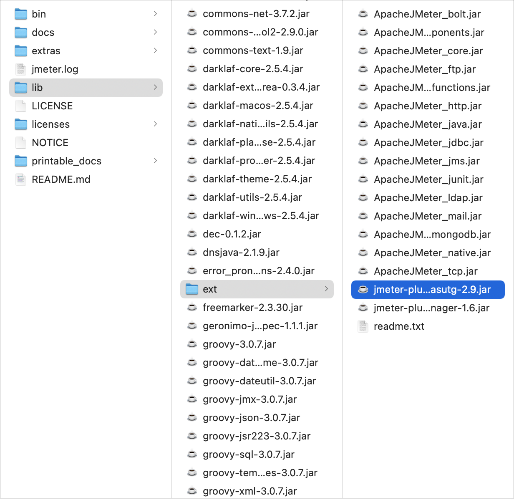

# JMeter Plugins

## Install Plugins Manager

1. JMeter Default Options
   
2. JMeter Default lib/ext directory
   
3. Go to [https://jmeter-plugins.org/install/Install/](https://jmeter-plugins.org/install/Install/)
   
4. Download jmeter plugins manage: 2 options
   1. Click `plugins-manager.jar`
   2. Direct download via [https://jmeter-plugins.org/get/](https://jmeter-plugins.org/get/)
5. Save `plugins-manager.jar` to JMeter Home `lib/ext` directory
   
6. Make sure the `plugins-manager.jar` is saved in `lib/ext`
   
7. Close and Open JMeter then Click JMeter Options
   

## Install Custom Thread Groups

- Prerequisite: [Install Plugins Manager](#install-plugins-manager)

1. Default Thread Group
   
2. Click JMeter `Options`, then `Select Plugins Manager`
   
3. On Available Plugins, check `Custom Thread Groups`
   
4. Close and Open JMeter again, then Verify Plugins
   1. Click `Add` -> `Threads (Users)`
      
   2. Go to `lib/ext` and looking for `jmeter-plugins-casutg-2.9.jar`
      
