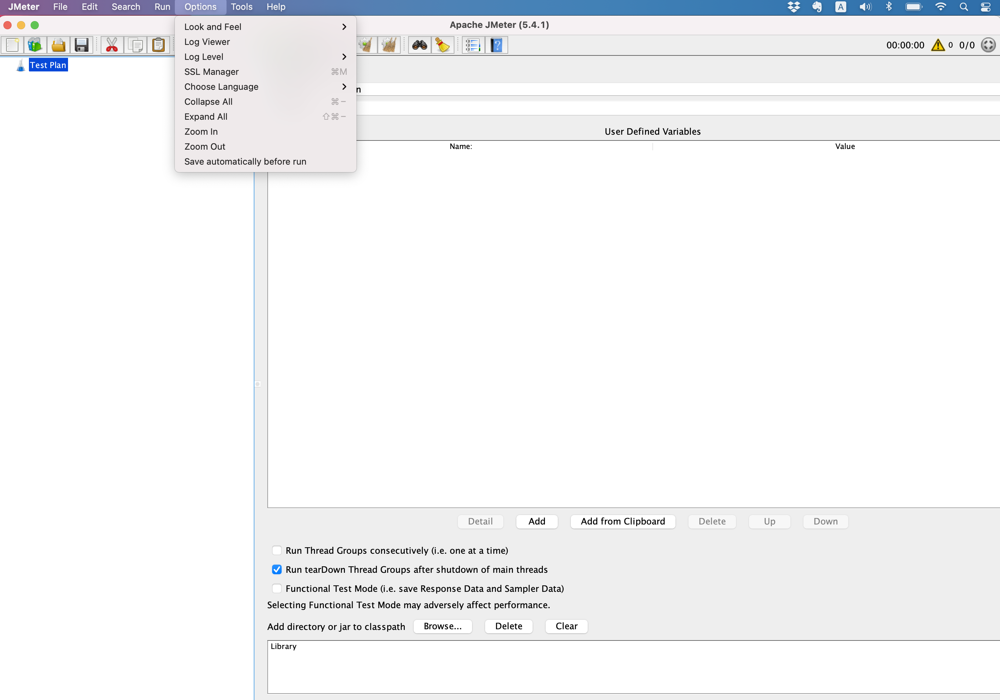
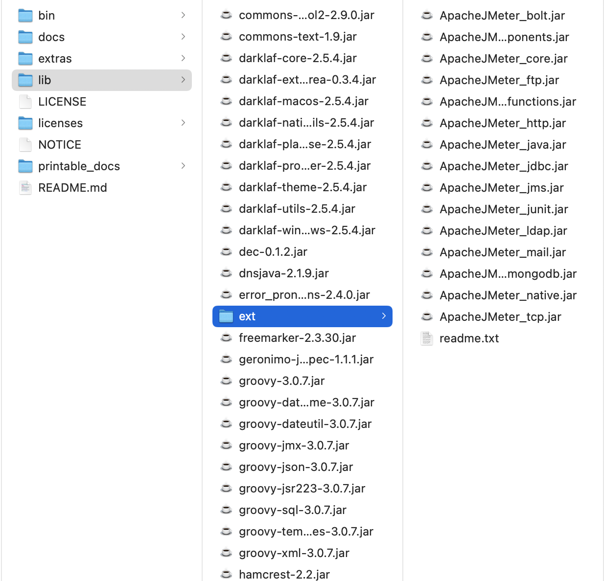
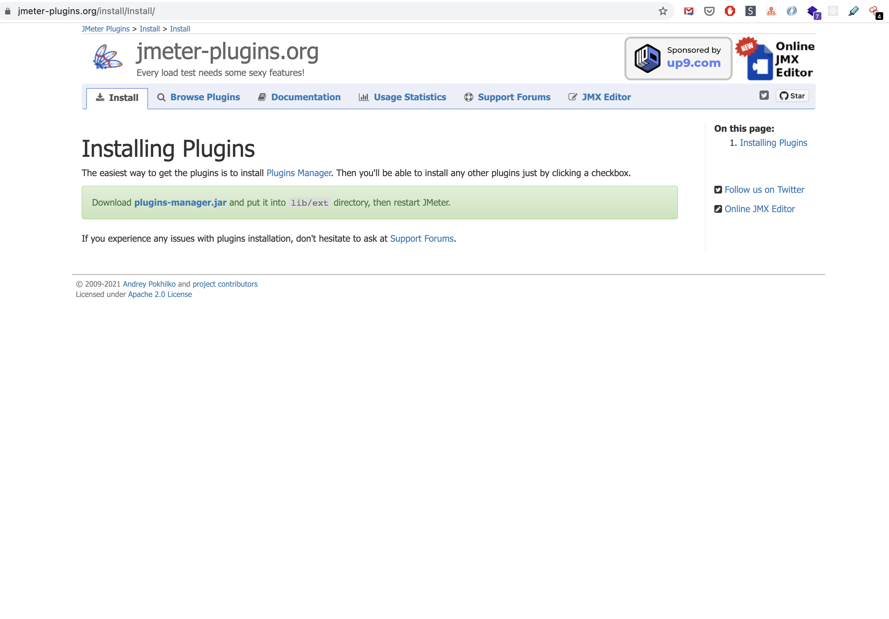
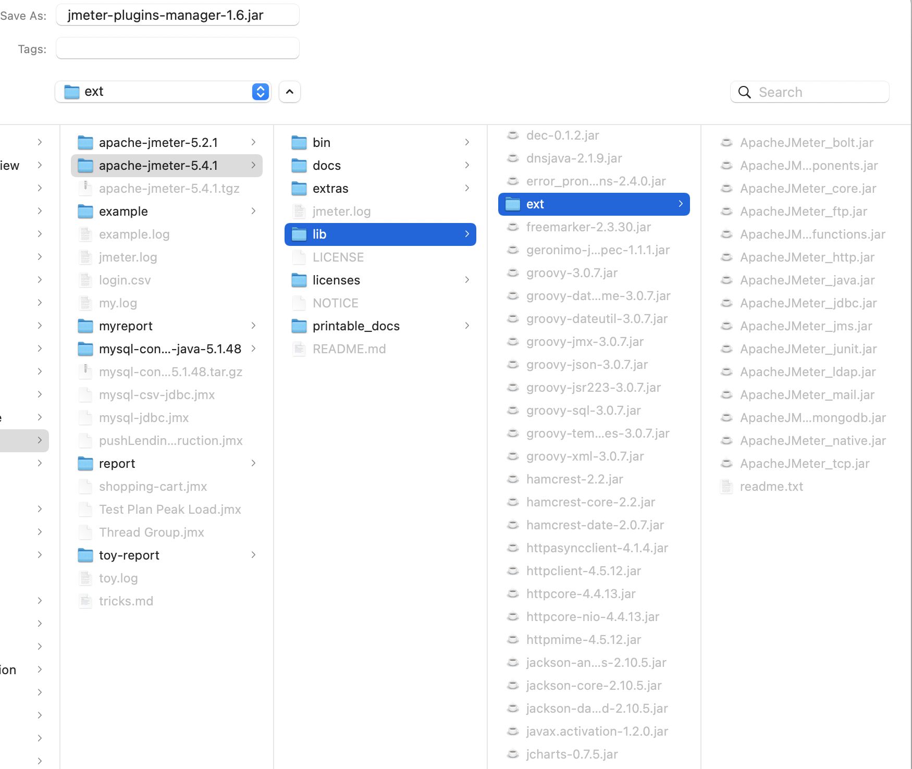
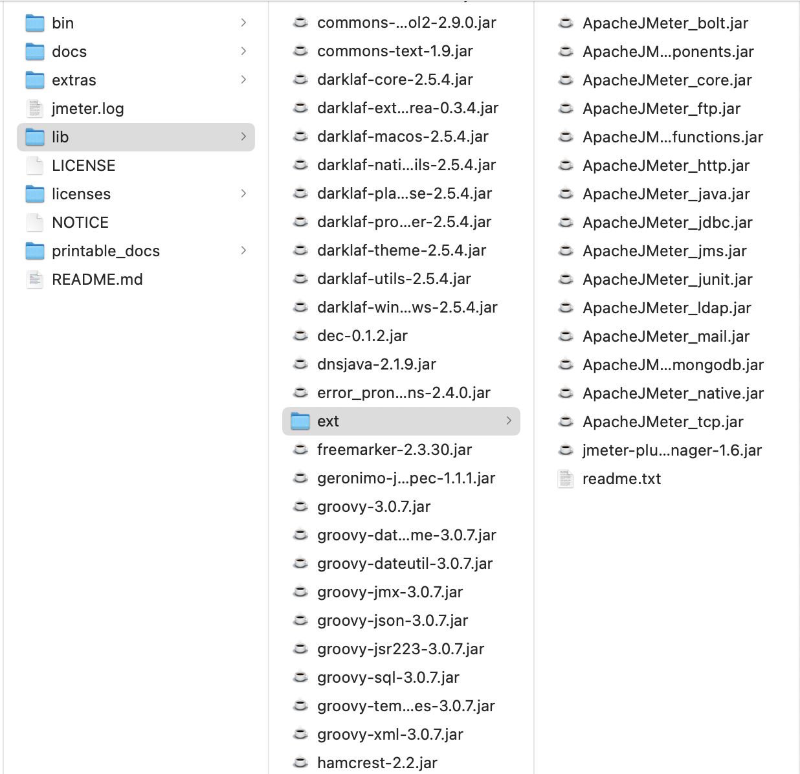
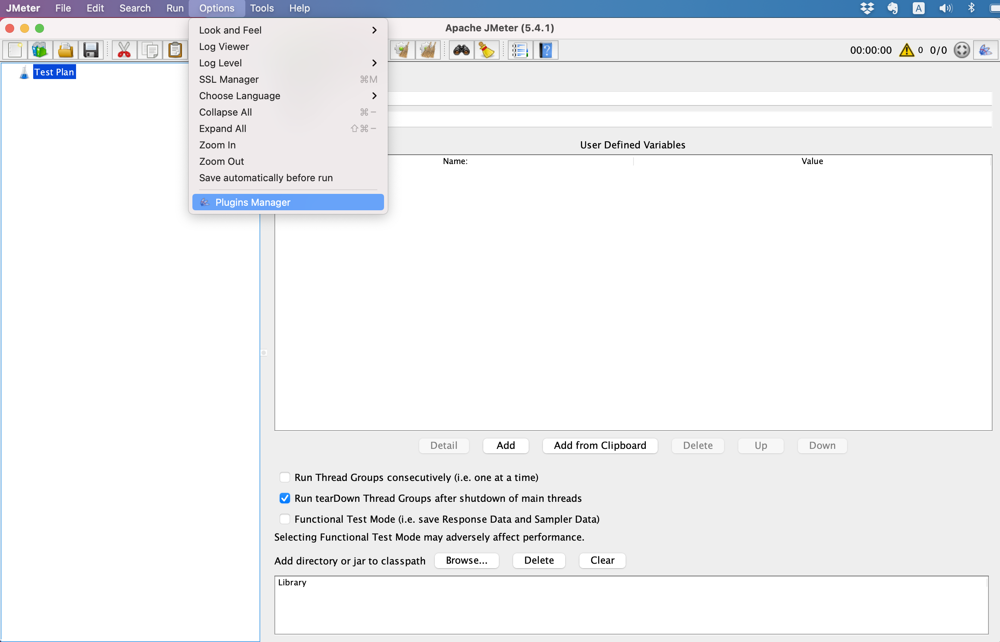

# JMeter Plugins

## Install Plugins Manager

1. JMeter Default Options
   
2. JMeter Default lib/ext directory
   
3. Go to [https://jmeter-plugins.org/install/Install/](https://jmeter-plugins.org/install/Install/)
   
4. Download jmeter plugins manage: 2 options
   1. Click `plugins-manager.jar`
   2. Direct download via [https://jmeter-plugins.org/get/](https://jmeter-plugins.org/get/)
5. Save `plugins-manager.jar` to JMeter Home `lib/ext` directory
   
6. Make sure the `plugins-manager.jar` is saved in `lib/ext`
   
7. Close and Open JMeter then Click JMeter Options
   