# Simple Thread Group

1. Create Test Plan: Name `Google Response 200`
   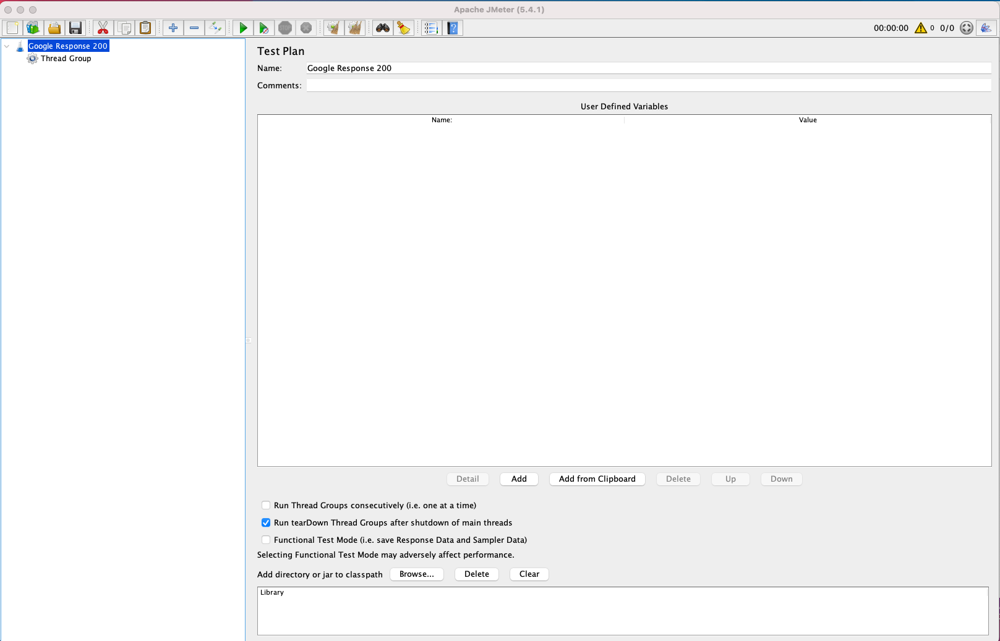
2. Add Thread Group: Select `Simple Thread Group`
   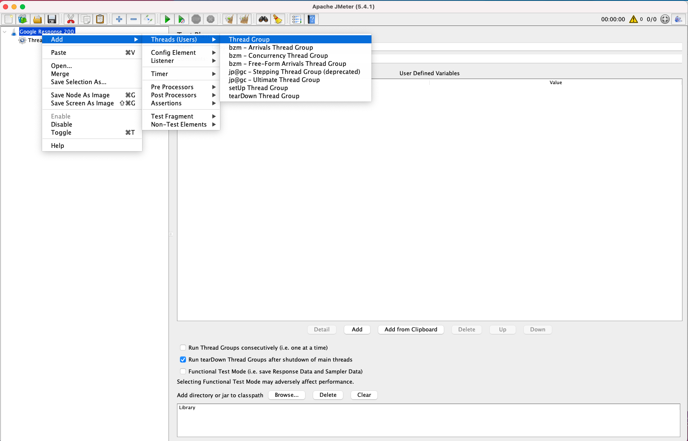
3. Set `Thread Properties`(use default values)
   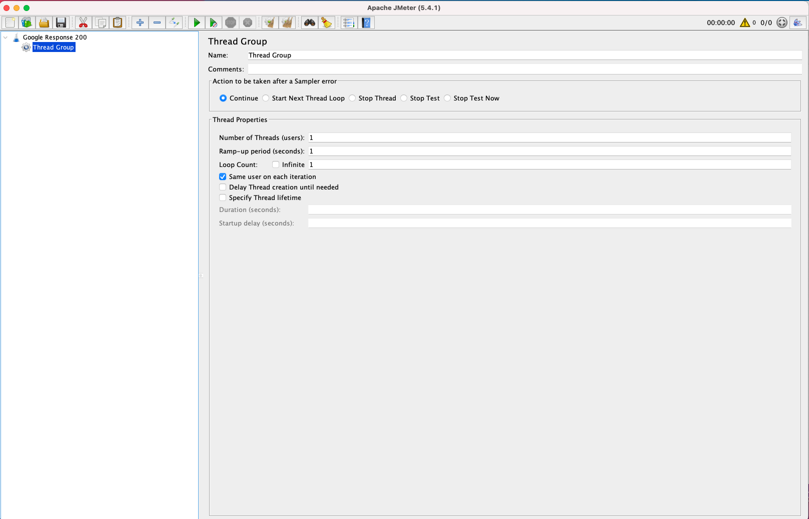
4. Add Sample: Select `HTTP Request`
   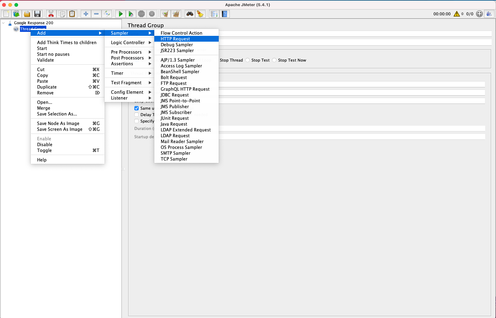
5. Set Server Name or IP: Call `google.co.th`
   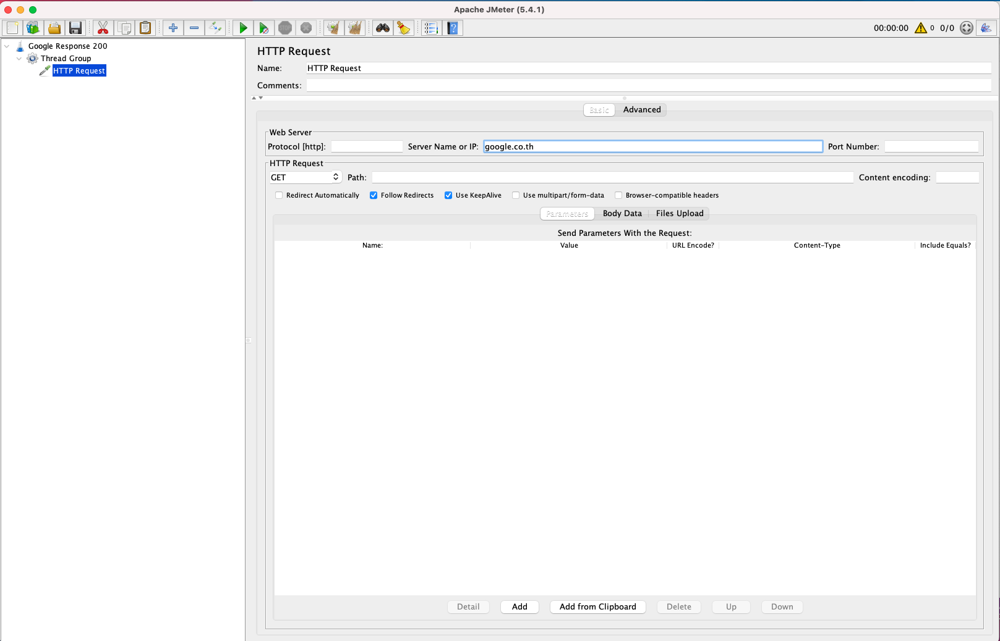
6. Add Assertions: Select `Response Assertion`
   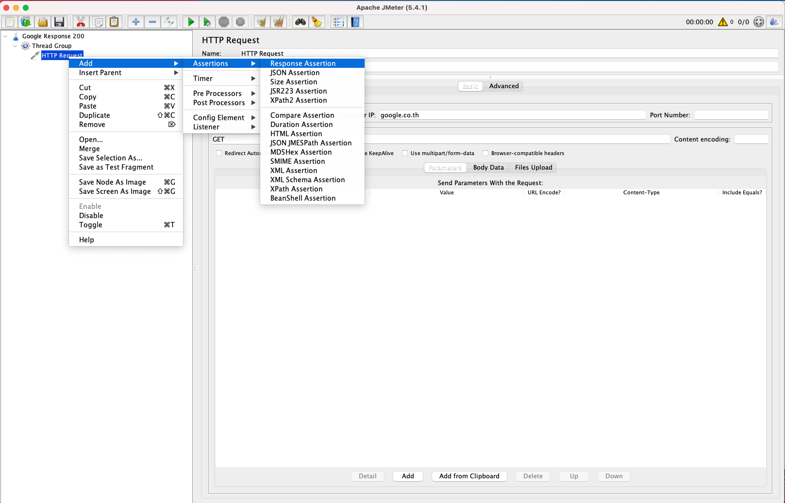
7. Select Field to Test: `Response Code`
   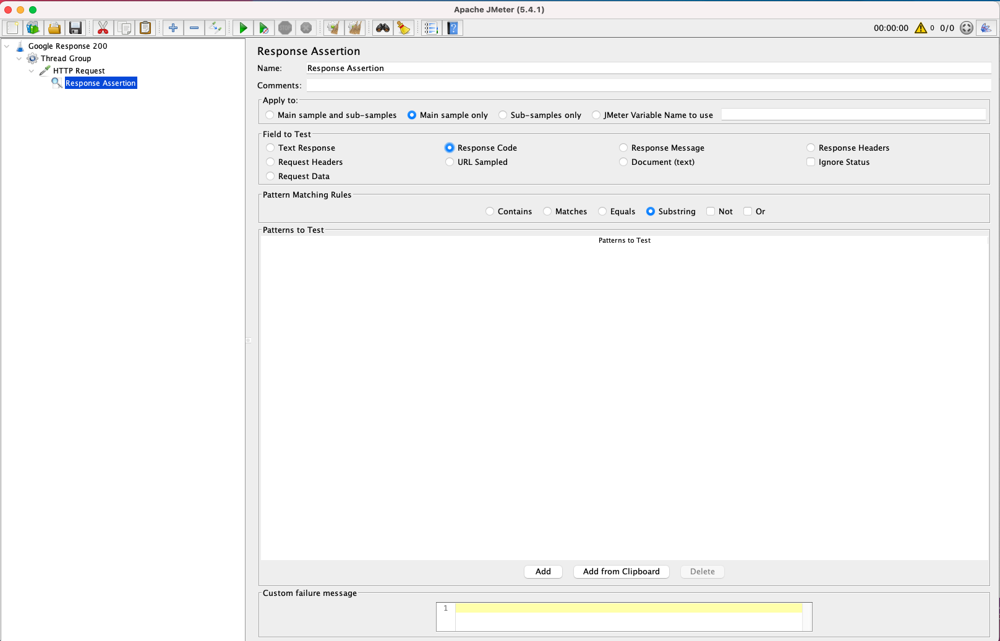
8. Select Pattern Matching Rules: `Contains` and set Patterns to Test with `200`
   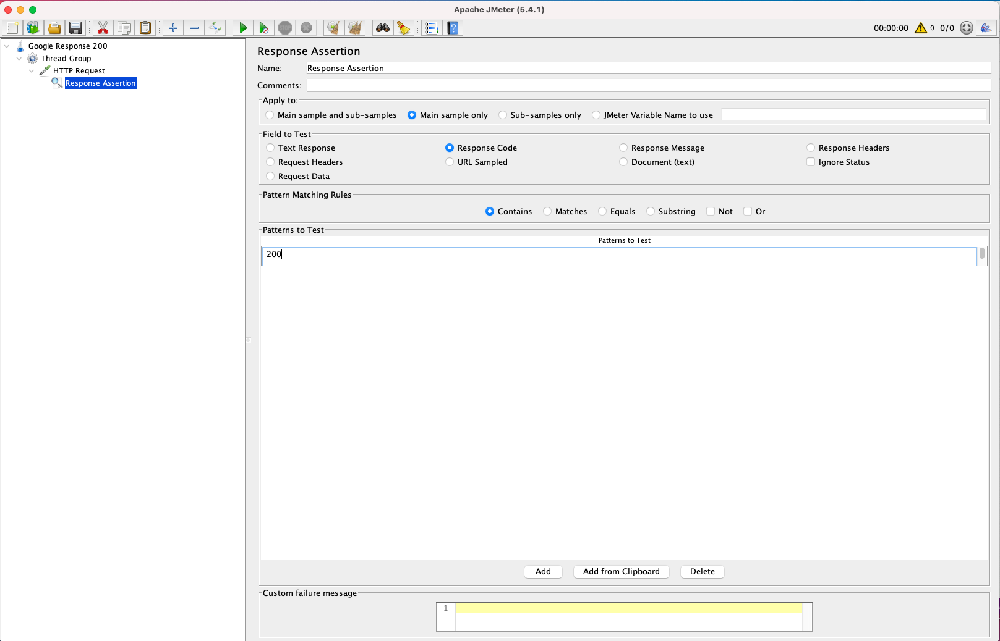
9. Add Listener: Select `View Results Tree`
   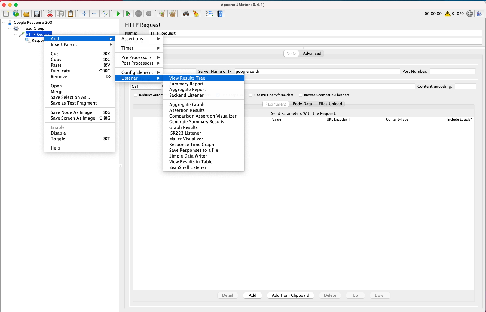
   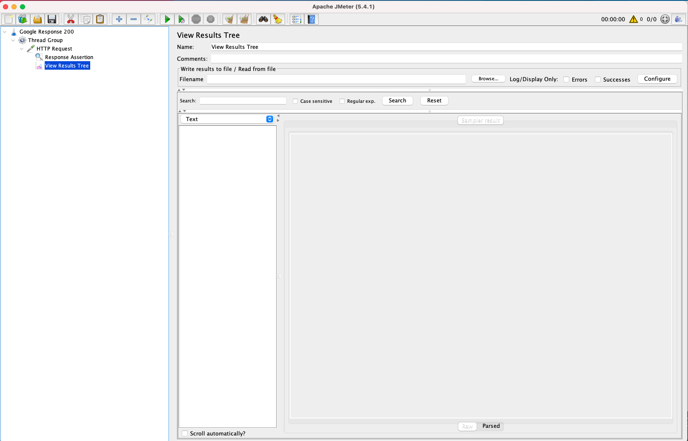
10. Add Listener: Select `Summary Report`
    
    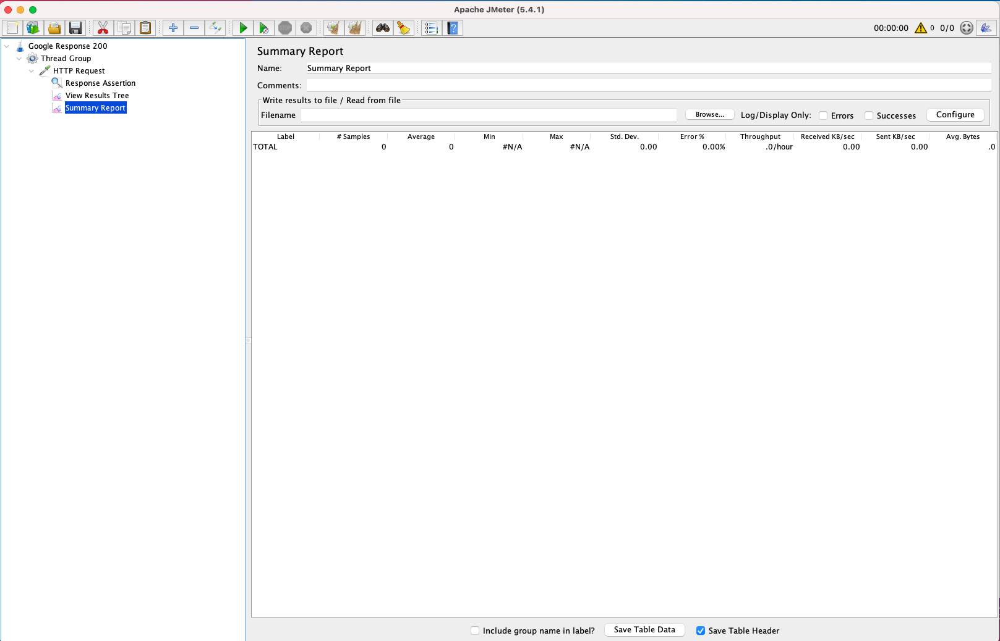
