# Toys'r not us

1. Create Test Plan: Name `Toy-R-Not-Us`
   - Save Test Plan with name: `Toy-R-Not-Us.jmx`
     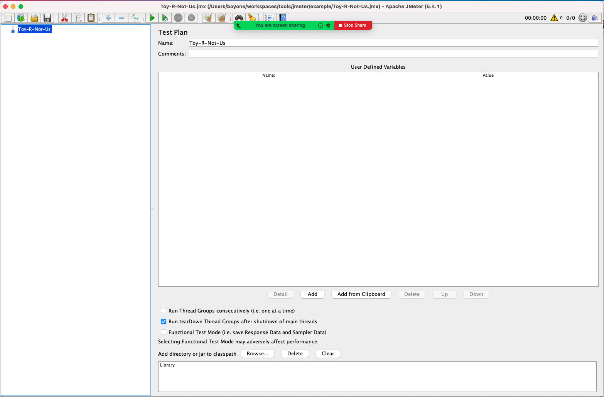
2. Add Sample: Select `HTTP Request`
   - Set Name: `API Product List`
   - Set Server Name or IP: `<Toys-R-Not-Us host>`
   - Select: `GET`
   - Set Path: `api/v1/product`
     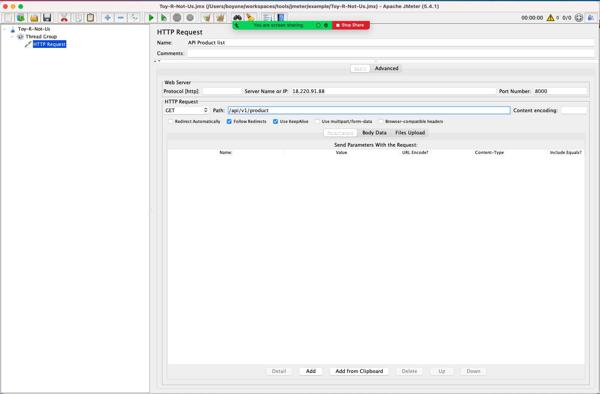
3. Add Assertions: Select `Response Assertion`
   - Check Field to Test: `Response Code`
   - Check Pattern Matching Rules: `Equals`
   - Set Response to Test: `200`
     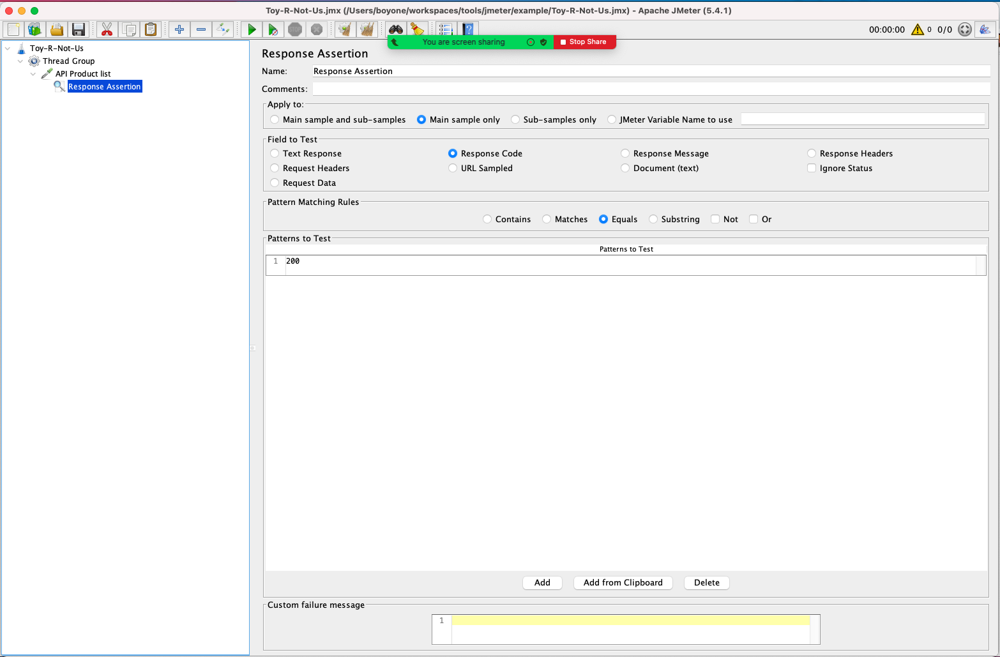
4. Add Assertions: Select `JSON Assertion`
   - Set Name: `Total should be 10031`
   - Set Assert JSON Path exists: `$.total`
   - Set Expected Value: `10031`
     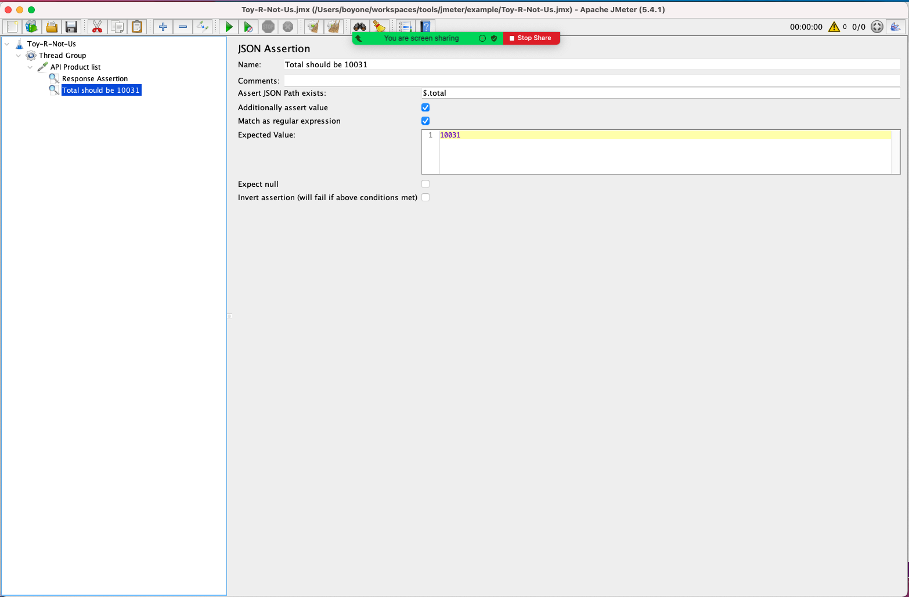
5. Add Post Processor
   - View Results Tree
   - Summary Report
   - Aggregate Report
     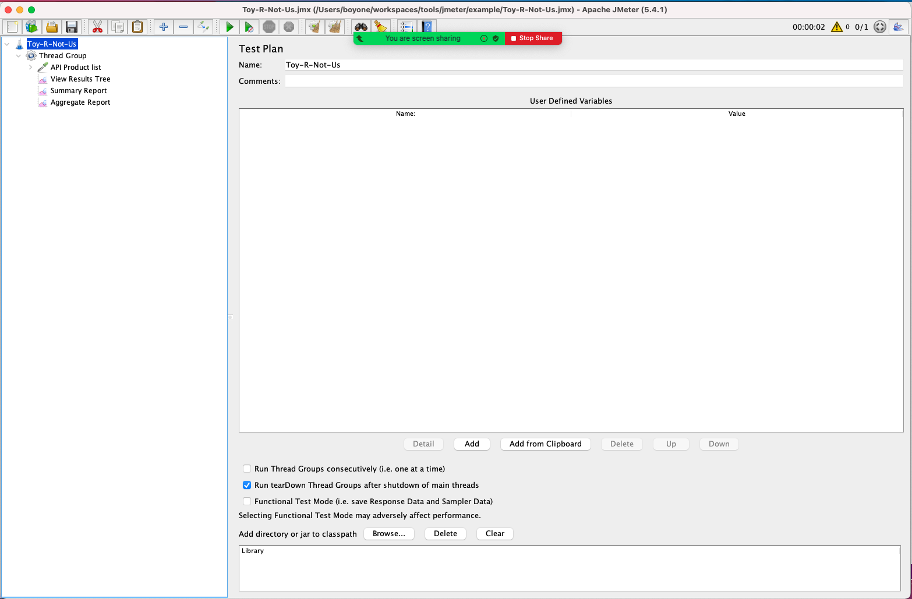
6. Add Sample: Select `HTTP Request`
   - Set Name: `API Product Detail`
   - Set Server Name or IP: `<Toys-R-Not-Us host>`
   - Select: `GET`
   - Set Path: `api/v1/product/2`
     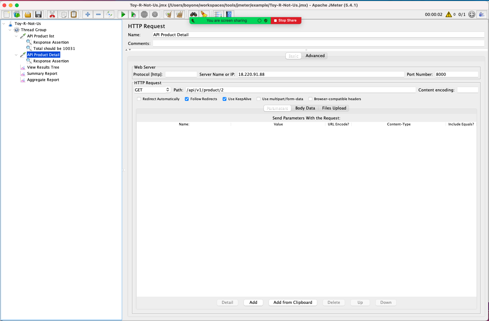
7. Add Assertions: Select `JSON Assertion`
   - Set Name: `Product Price should be 12.95`
   - Set Assert JSON Path exists: `$.product_price`
   - Set Expected Value: `12.95`
     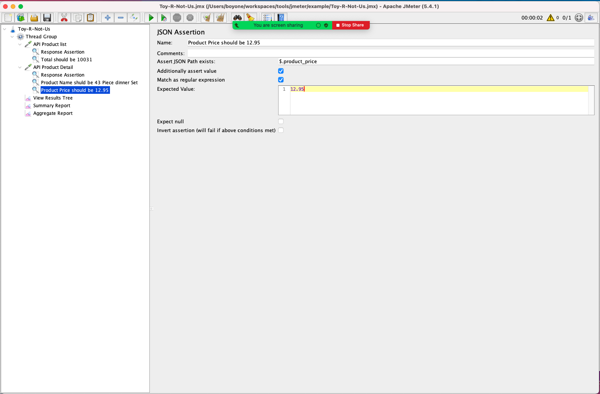
8. Add Sample: Select `HTTP Request`

   - Set Name: `API Submit Order`
   - Set Server Name or IP: `<Toys-R-Not-Us host>`
   - Select: `POST`
   - Set Path: `api/v1/order`
   - Set Body Data

     ```json
     {
       "cart": [
         {
           "product_id": 2,
           "quantity": 1
         }
       ],
       "shipping_method": "Kerry",
       "shipping_address": "405/37 ถ.มหิดล",
       "shipping_sub_district": "ท่าศาลา",
       "shipping_district": "เมือง",
       "shipping_province": "เชียงใหม่",
       "shipping_zip_code": "50000",
       "recipient_name": "ณัฐญา ชุติบุตร",
       "recipient_phone_number": "0970809292"
     }
     ```

     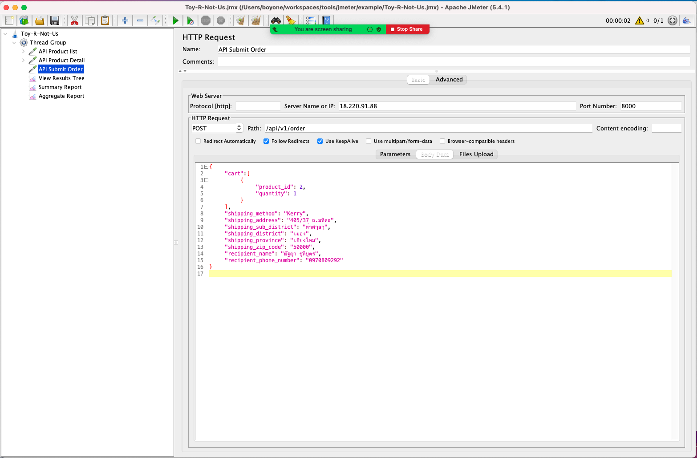

9. Add Post Processors: Select `JSON Extractor`
   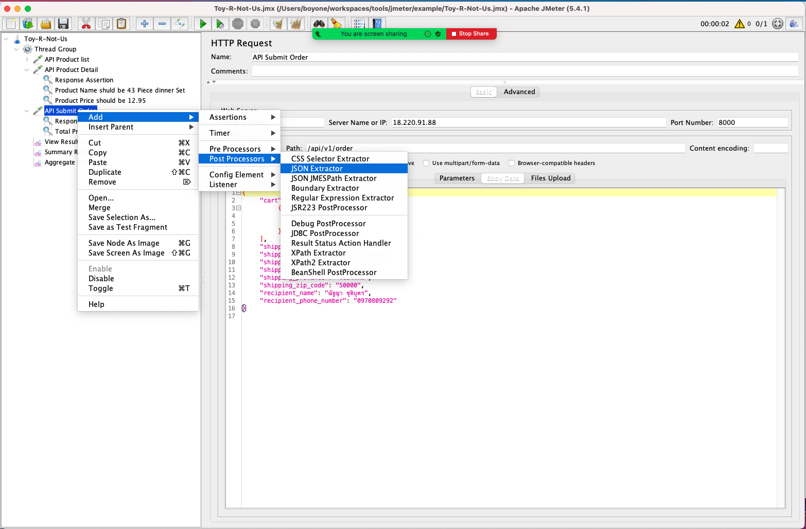
10. Set JSON Extractor Properties

    - Set Name: `Extract Order ID`
    - Set Names of created variables: `order_id`
    - Set JSON Path expressions: `$.order_id`

    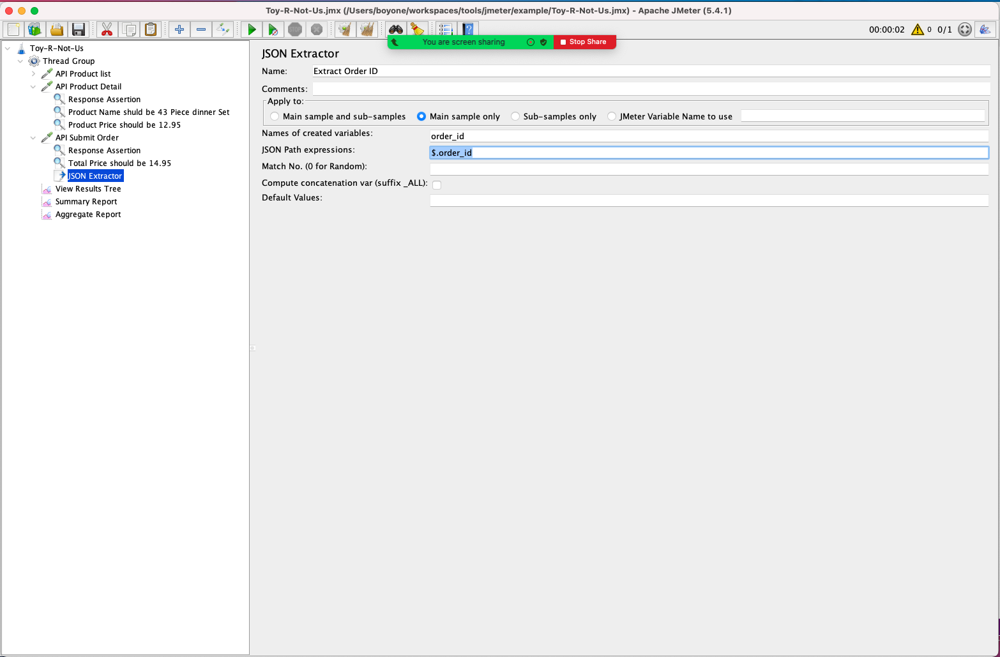

11. Add Sample: Select `HTTP Request`

    - Set Name: `API Confirm Payment`
    - Set Server Name or IP: `<Toys-R-Not-Us host>`
    - Select: `POST`
    - Set Path: `api/v1/confirmPayment`
    - Set Body Data

    ```json
    {
    "order_id" : ${order_id},
    "payment_type" : "credit",
    "type" : "visa",
    "card_number" : "4719700591590995",
    "cvv" : "752",
    "expired_month" : 7,
    "expired_year" : 20,
    "card_name" : "Karnwat Wongudom",
    "total_price" : 14.95
    }
    ```

    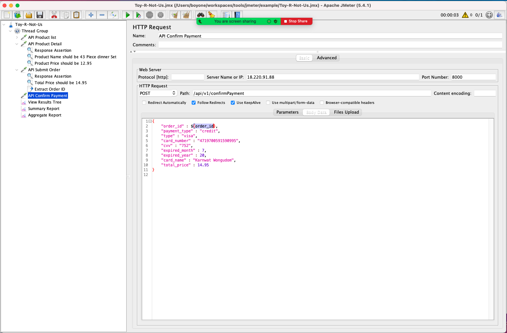

12. Run Test Plan via command line

    - jmeter `-n` `-t` `<path to jmeter file>` `-l` `path to result file` `-e` `-o` `path to jmeter report directory`

    | Option | Descriptor                |
    | ------ | ------------------------- |
    | -n     | non GUI mode              |
    | -t     | test file                 |
    | -l     | results file              |
    | -e     | generate report dashboard |
    | -o     | output report directory   |

    - example

      ```sh
      apache-jmeter-5.4.1/bin/jmeter -n -t example/Toy-R-Not-Us.jmx -l toy.log -e -o toy-report
      ```

    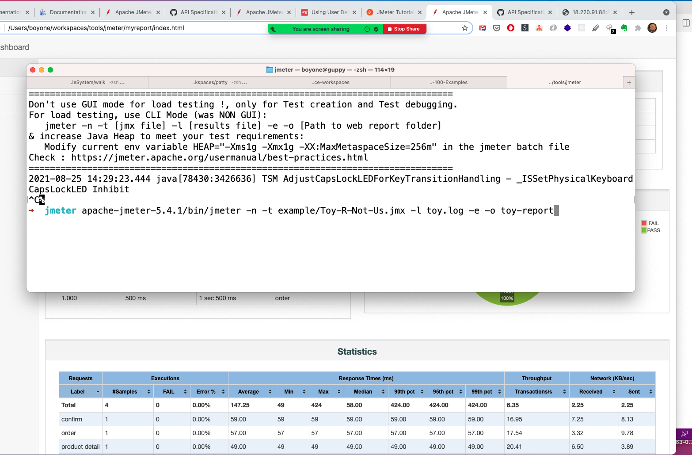

---

## References

1. [shopping-cart](https://github.com/SCK-SEAL-TEAM-One/shopping-cart)