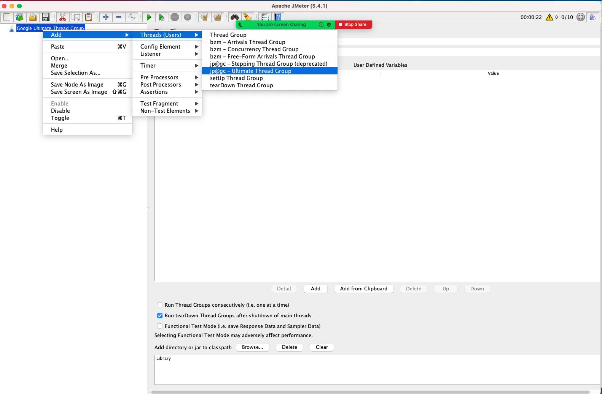

# Ultimate Thread Group

1. Create Test Plan: Name `Google Ultimate Thread Group`
   
2. Add Thread Group: Select `jp@gc - Ultimate Thread Group`
   
   
3. Set `Thread Schedule`

   - Start Thread Count: `5`
   - Initial Delay, sec: `0`
   - Startup Time, sec: `5`
   - Hold Load For, sec: `85`
   - Shutdown Time: `30`

   

4. Set `Thread Schedule`

   - Start Thread Count: `15`
   - Initial Delay, sec: `5`
   - Startup Time, sec: `5`
   - Hold Load For, sec: `80`
   - Shutdown Time: `30`

   
