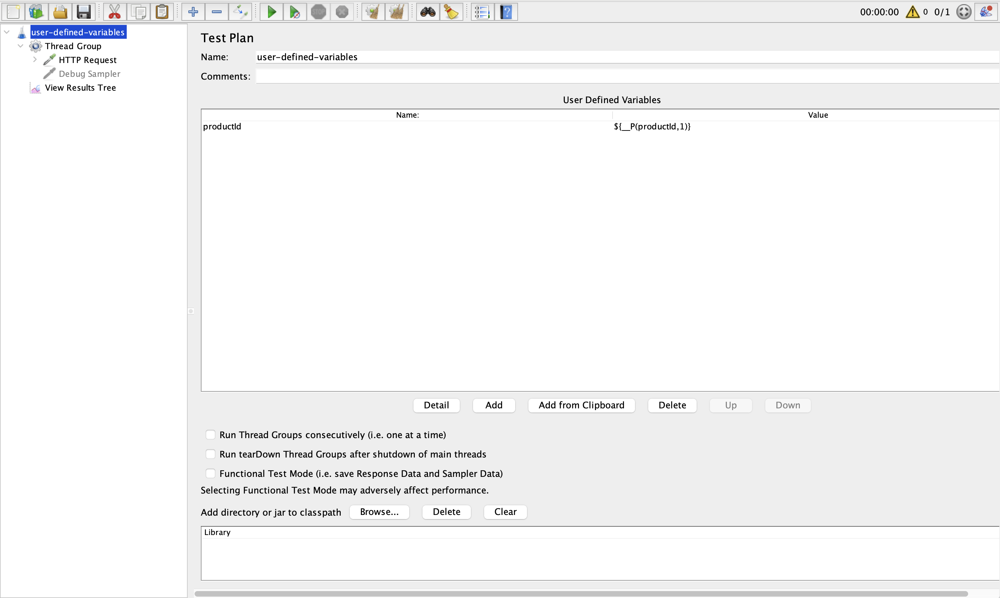
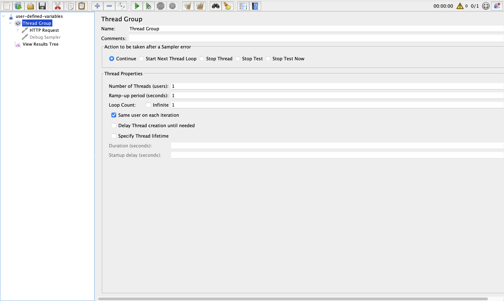
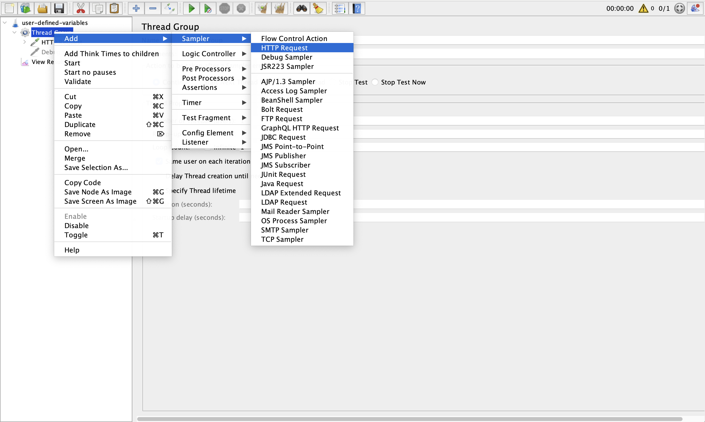
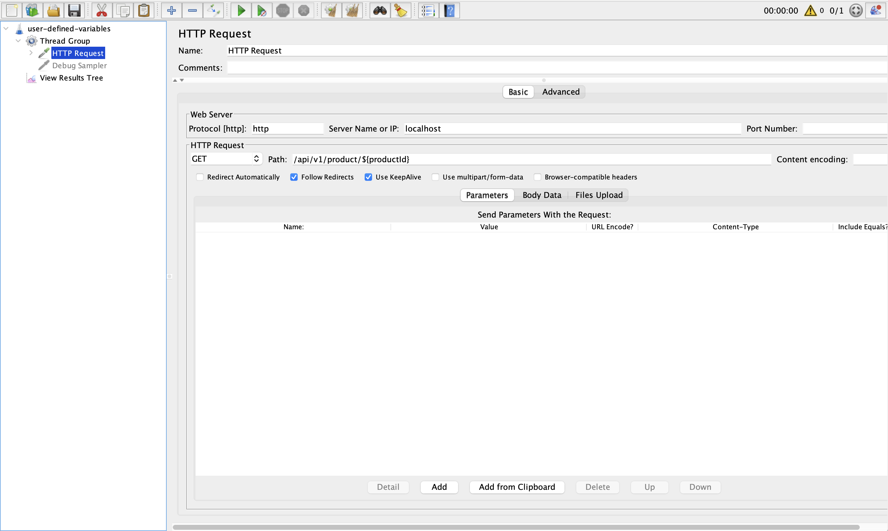
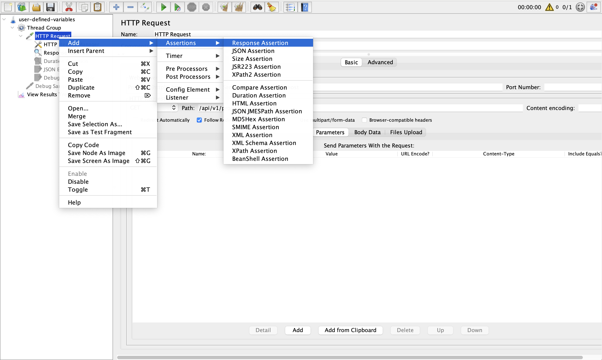
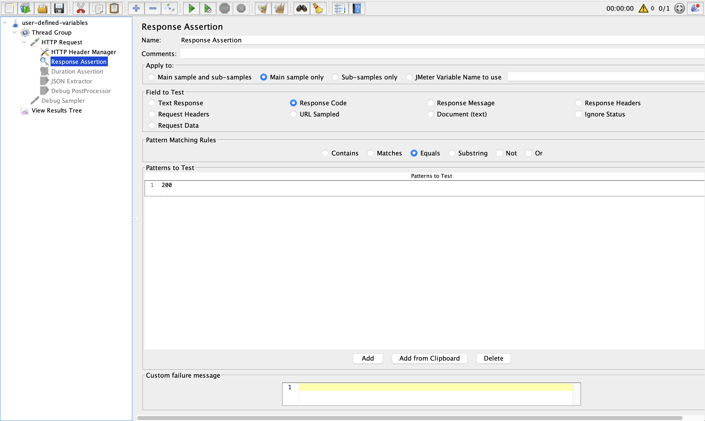

# User Defined Variables and \_\_P function

`examples/user_defined_variables/user_defined_variables.jmx`

1. [Start Sck Online Store](#start-sck-online-store)
2. [Create Test Plan](#create-test-plan)

---

## Start `sck-online-store`

1. Clone `sck-online-store` from github to `workspace`

   ```sh
   git clone https://github.com/SCK-SEAL-TEAM-One/sck-online-store.git
   ```

2. Change directory to `sck-online-store`

   ```sh
   cd sck-online-store
   ```

3. Start sck-online-store with docker compose

   ```sh
   docker compose up -d thirdparty point-service db store-service store-web nginx
   ```

---

## Create Test Plan

1. Create Test Plan call `Test_Plan` with `User Defined Variable`
   - Name: `productId`
   - Value: `${__P(productId, 1)}`  
     return value of property `productId` or `1` if not defined
     
2. Create Test Group with `Thread Group`
   
3. Set `Http Request` with `variables`
   
   - Path: `/api/v1/product/${productId}`
     
4. Add `Response Assertion`
   
   
5. Run via command line

   ```sh
   bin/jmeter -n -t <path to>/examples/user-defined-variables/user_defined_variables.jmx -l results.jtl -e -o report -f
   ```

6. Check result

   ```sh
   cat results.jtl
   ```

7. Run via command line with property `productId`

   ```sh
   bin/jmeter -n -t <path to>/examples/user-defined-variables/user_defined_variables.jmx -l results.jtl -e -o report -f -J productId=3
   ```

8. Check result

   ```sh
   cat results.jtl
   ```

---

## References

1. [\_\_P funtions](https://jmeter.apache.org/usermanual/functions.html#__P)
